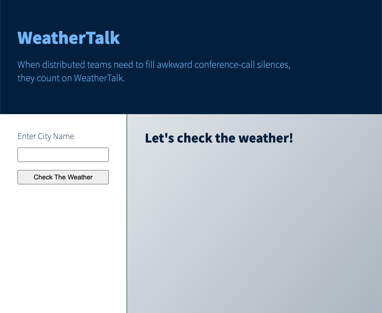
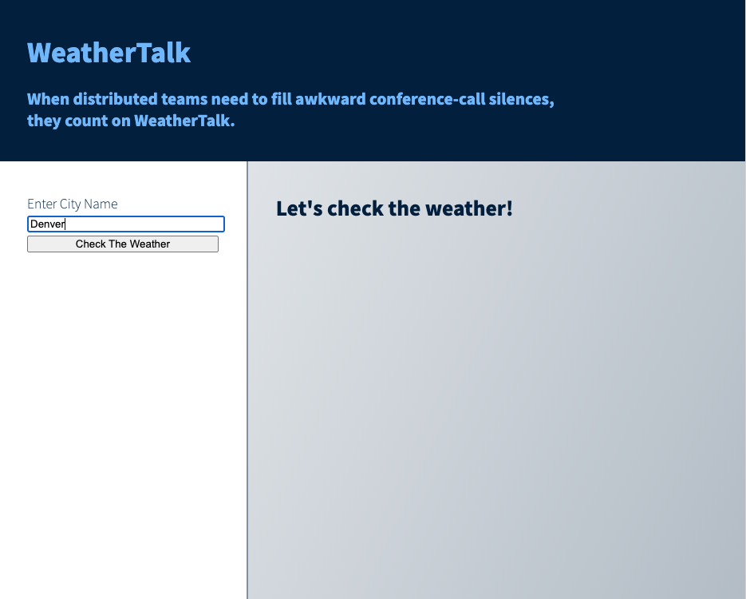
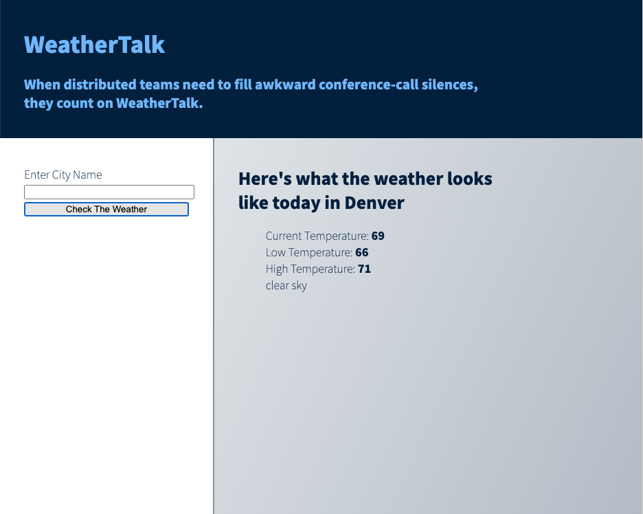

# Introduction to the OpenWeather Current Weather Data API

<!-- outline / structure notes -->

### Goals

By the end of this tutorial, you will be familiar with:

* How to get started using a public API
* Incorporating the Open Weather Map API in your own sample project
* The capabilities of the Open Weather API

### Overview

In this tutorial, we'll be using one of OpenWeather's free APIs. The OpenWeather API collection provides robust and easy-to-use weather data through a public API. With both free and subscription services, this tool provides developers access to a vast set data that is straightforward to incorporate into projects. From simple weather status results to complex data visualizations, OpenWeather has an API that can handle whatever creative endeavors you may have in mind.

Today, we'll build a locally-running small static site using vanilla JavaScript, HMTL, and CSS that displays city-specific weather data from the **OpenWeather Current Weather Data API**. By keeping the structure we're working within foundational, we can focus on the API as we become familiar with it rather than any framework-specific nuances. The concepts and approaches used in this basic application can be translated into the framework of your choice as you tackle larger, more complex projects leveraging OpenWeather APIs.

---

### Getting started

Getting up and running with the OpenWeather suite of APIs is user friendly. Navigate over to [OpenWeather Current and Forecast weather data collection](https://openweathermap.org/api), where you'll see all the API offerings available through OpenWeather. Each individual API has a brief overview on this page, as well as `API doc` and `Subscribe` buttons where you'll find documentation and be able to sign up to receive a unique API key for that particular data collection.

Click the `Subscribe` button under **Current Weather Data**, and you'll be directed to a pricing page. Here you'll find details on the available packages offered for this data collection. Click the `Get API Key` button under **Free** and you'll be prompted to create a new account. Once done, you can find your unique API key on your accounts page under the `API key` tab.

Once you have your key, you can try it out by entering the following API call in your browser.

```
api.openweathermap.org/data/2.5/weather?q={city name}&units=imperial&appid={API key}
```

If we break this down, we'll see two sets of curly braces: `{city name}` and `{API key}`. The content within these braces indicates the content you should update. Enter the name of a city you'd like to see weather data for as well our unique API key. `units=imperial` indicates that we want our temperature to be shown in Fahrenheit. An example of the completed url is:

```
api.openweathermap.org/data/2.5/weather?q=Denver&units=imperial&appid=f2e53f539786e6ab3e9318da74a9bc35
```

When we run this in the browser, we'll see the API response in the form of a JSON object. Take a moment and read through this to familiarize yourself with it -- these are all the values we can leverage as we begin to work with this API in our project. It should look something like this:

```json
{
  "coord": {
    "lon": -104.9847,
    "lat": 39.7392
  },
  "weather": [
    {
      "id": 801,
      "main": "Clouds",
      "description": "few clouds",
      "icon": "02d"
    }
  ],
  "base": "stations",
  "main": {
    "temp": 291.85,
    "feels_like": 286.83,
    "temp_min": 289.26,
    "temp_max": 293.15,
    "pressure": 1007,
    "humidity": 12
  },
  "visibility": 10000,
  "wind": {
    "speed": 2.68,
    "deg": 155,
    "gust": 7.6
  },
  "clouds": {
    "all": 23
  },
  "dt": 1616265830,
  "sys": {
    "type": 3,
    "id": 2004334,
    "country": "US",
    "sunrise": 1616245370,
    "sunset": 1616289103
  },
  "timezone": -21600,
  "id": 5419384,
  "name": "Denver",
  "cod": 200
}
```

This API response confirms that our API key is working, and now we can pull the data being returned into our application.

---

### The Project: Weather Talk

We'll be building a small application that helps start conversations with your colleagues on who live in different cities. When you don't know what to talk about, talk about the weather!

> Note: You can clone down this repo to run the example project locally on your machine. Because it is a simple static application, there are no required dependencies (but remember to use your own API key) -- you should be able to clone and go!

#### Getting up and running

* In your command line run `git clone https://github.com/LouisaBarrett/weathertalk.git`
* Navigate to the directory
* Run `open index.html` from your terminal to run the project locally

We'll be building this simple web app:





To work along, you'll need to create HTML, CSS, and JavaScript files. The files names we'll be using in this tutorial are:

* index.html
* style.css
* reset.css _(note: we're using a reset file to have a bit more control over our styles)_
* script.js

Once you've created you working files, go ahead and add the following HTML to your `index.html` file:

```HTML
<!DOCTYPE html>
<head>
  <title>WeatherTalk</title>
  <meta name="viewport" content="width=device-width, initial-scale=1">
  <link rel="stylesheet" href="style.css">
</head>
<body>
  <h1>WeatherTalk</h1>
  <ul class="weather-data"></ul>
  <script type="text/javascript" src="script.js"></script>
</body>
```

#### Fetching The Weather Data

As a first step, start by making a call to the API and rendering the response in the DOM. We'll be using the [`fetch()` method](https://developer.mozilla.org/en-US/docs/Web/API/Fetch_API/Using_Fetch) to allow us to make our API calls. This is part of JavaScript's [Fetch API](https://developer.mozilla.org/en-US/docs/Web/API/Fetch_API). The Fetch API provides us an interface to, well, fetch resources across a network using HTTP. We will be using a basic fetch request for our app, which looks like this:

```javascript
fetch('http://example.com/sample.json')
  .then(response => response.json())
  .then(data => console.log(data));
```

We can see that the `fetch()` method takes an argument of the path to the resource you would like to fetch, and then returns a promise which contains the response. This is what is being logged to the console in the last line. In this example, the path to the resource we was to fetch is `http://example.com/sample.json` Let's try it out with the url for the OpenWeather API we defined above using our unique API key.

In your JavaScript file, write the following function:

```javascript
const fetchData = () => {
  fetch('https://api.openweathermap.org/data/2.5/weather?q=Denver&units=imperial&appid=f2e53f539786e6ab3e9318da74a9bc35')
  .then(response => response.json())
  .then(data => console.log(data))
}

fetchData()
```

> Tip: You must include http or https in the url you pass in as the argument here, or you will be met with a [CORS](https://developer.mozilla.org/en-US/docs/Glossary/CORS) error message.

To do a bit of future planning in our code, let's go ahead with a quick refactor to pull our unique API key into a global variable and the API url out into it's own function that we can then use within our `fetchData()` function. Our refactored code will look like this:

```javascript
const API_KEY = 'f2e53f539786e6ab3e9318da74a9bc35' // Replace this key with your own unique API key

const updateCity = () => {
  return `http://api.openweathermap.org/data/2.5/weather?q=Denver&units=imperial&appid=${API_KEY}`
}

const fetchData = () => {
  fetch(updateCity())
  .then(response => response.json())
  .then(data => console.log(data))
}

fetchData()
```

> Note: It is not best practice to share an API key publicly as we are doing in this tutorial -- we can get away with it while working locally, but if this were a site in production doing so would present security risks. This type of private data is typically found in a project's server-side code, which our small site does not have. Separating this information out into a discrete variable and function would allow us to more easily move this code to the backend if we were to expand the scope of this project in the future.

Open your HTML file in your browser and take a look at the console to see what was logged there. You should see the same JSON object that we saw when we ran that url directly in the browser -- success! Now we can render this current weather data in the DOM.

#### Connecting the Data to the DOM

We'll need something in our HTML to use as a hook for our JavaScript, so let's add an unordered list with a class of "weather-list" to the body of `index.html`. It should look like this:

```HTML
<ul class="weather-list">
  <!-- weather data rendered here -->
</ul>
```

Back in our JavaScript file, we'll add a global variable that will hold this `ul` for us to use when rendering the data being returned from the API. We'll also update our `fetchData()` function to replace the `console.log()` with functional code to add an `li` within our `weatherList` unordered list using template literal syntax.

We'd like to render the city name, information about the current temperature, and a description of the weather from the city that we've specified in the url that we're using to fetch the data.

There are three keys in the JSON object that we'll need to get values from: `main`, `name`, and `weather`. Take another look at the JSON object that we're getting back from this API call to see how to target the specific values we want to render. Using the `innerHTML` property, update the `fetchData()` function to add list items with this content to the `weatherList` unordered list.

> Hint: Pay attention to the data types of the values assigned to object keys. We can see that `weather` is assigned an array of objects as a value, so we'll need to use bracket notation to drill down into that, and we'll need to use dot notation pull the desired values from the object assigned as the value to `main`.

Here's what the updated function will look like:

```JavaScript
const weatherList = document.querySelector(".weather-list")
const API_KEY = 'f2e53f539786e6ab3e9318da74a9bc35' // Replace this key with your own unique API key

const updateCity = () => {
  return `http://api.openweathermap.org/data/2.5/weather?q=Denver&units=imperial&appid=${API_KEY}`
}

const fetchData = () => {
  fetch(updateCity())
  .then(response => response.json())
  .then(data => {
    weatherList.innerHTML = `<li>${data.name}<li>
                             <li>${data.main.temp}<li>
                             <li>${data.main.temp_min}<li>
                             <li>${data.main.temp_max}<li>
                             <li>${data.weather[0].description}<li>`
  });
}

fetchData()
```

Refresh `index.html` in your browser, and you should see your specified cities data being rendered.

<!-- NOTE FOR LOUISA: include a blurb about how to specify the temperature type in the url "Why does this look weird? let's fix it" sort of thing -->

### Forms and User Generated Data

The main purpose of our WeatherTalk app is to help remote coworkers make small talk about the weather in their respective cities. Right now our application doesn't allow for much flexibility in changing what city's weather is being displayed. Adding a form for a user to input the city name that the weather results are based on would make this more useful.

Let's add a form input and submit for our users to our HTML file:

```HTML
<form>
  <label for="city">Enter City Name</label>
  <input id="city" type="text" value="">
  <input type="submit" id="city-btn-js" value="Check The Weather">
</form>
```

Now we'll add an event lister in our JavaScript file to listen for click events on the submit button we've created as well as variables so we can target the input and the submit. Our event our event lister and the associated variables will look like this:

```javascript
const submitBtn = document.querySelector('#city-btn-js');
const nameInput = document.querySelector('#city')

submitBtn.addEventListener('click', event => {
  event.preventDefault();
  fetchData(nameInput.value);
})
```

> Tip: Notice that we've moved the function call for `fetchData()` inside our event listener so it isn't run until the user intentionally submits the name of a city. Make sure to check that you don't have a duplicate function call outside of the event listener!

There is some refactoring to do within the `updateCity()` function to allow it to utilize this user generated input. We'll need to pass in a parameter that we can then embed within the url for the API call and then we will want to clear out the value of the input after we've rendered the list items. Let's take a look:

```javascript
const updateCity = (city) => {
  return `http://api.openweathermap.org/data/2.5/weather?q=${city}&units=imperial&appid=${API_KEY}`
}

const fetchData = (city) => {
  fetch(updateCity(city))
  .then(response => response.json())
  .then(data => {
   weatherList.innerHTML = `<li>${data.name}<li>
                            <li>${data.main.temp}<li>
                            <li>${data.main.temp_min}<li>
                            <li>${data.main.temp_max}<li>
                            <li>${data.weather[0].description}<li>`
  nameInput.value = ""
 });
}
```

Reload your page in the browser and give it a try. You should see that the hard coded list of city-specific weather information is gone, and we now only see the form. When a city's name is entered into the input field and submitted, you should see the weather data populated with information for the user-specified city.

This gives us basic functionality using data returned from the OpenWeather Current Weather Data API. Now we a foundation ready to play around with the API, and we'll take a look at a couple of fun addition functionality and UI details to help sprout ideas about new ways to utilize OpenWeather APIs in future projects.

#### UI Refinement and Additional Functionality

Now that we have our basic functionality, let's tighten up the user experience and do some work that leverages the API data in a less direct way.  We'll add the following:

* Layout and copy (another word for the text content) refinement that clarifies what the data being displayed means for the user
* A "conversation prompt" section that gives topic suggestions based on the daily temperature of the specified city
* The ability to change the color of the background on the main section of our page based on the current conditions of the specified city

<!-- NOTE FOR LOUISA: UI update with aside and the prompts on the left section -->
Let's tidy up our UI and make it a bit more appealing to users and a bit less "HTML from the '90s." It would be nice to move the `H1` to a `header` and the form to an `aside` so we can more space for the primary content that we're pulling from the API. We also could use some copy to help clarify what we're looking at.

Let's add a custom font into our `head` tag:

```html
<head>
  <title>WeatherTalk</title>
  <link rel="preconnect" href="https://fonts.gstatic.com">
  <link href="https://fonts.googleapis.com/css2?family=Noto+Sans+JP:wght@100;900&display=swap" rel="stylesheet">
  <link rel="stylesheet" href="style.css">
</head>
```

Now we'll begin the layout and structural updates to our HTML:

```HTML
<body>
  <header>
    <h1>WeatherTalk</h1>
    <h3>When distributed teams need to fill awkward conference-call silences,<br> they count on WeatherTalk.</h3>
  </header>
  <form>
    <label for="city">Enter City Name</label>
    <input id="city" type="text" value="">
    <input type="submit" id="city-btn-js" value="Check The Weather">
  </form>
  <main class="main-wrap">
    <aside>
        <form>
          <label for="city">Enter City Name</label>
          <input id="city" type="text" value="">
          <input type="submit" id="city-btn-js" value="Check The Weather">
        </form>
    </aside>
    <section>
      <h2 id="city-name-js">Let's check the weather!</h2>
      <ul class="weather-list">
        <!-- OWM data rendered here -->
      </ul>
    </section>
  </main>
  <script type="text/javascript" src="script.js"></script>
</body>
```

What the app looks like in the browser hasn't changed significantly, but we've set ourselves up to do some work in our CSS to make the layout look a little nicer. The styling changes are pretty lightweight, but they will make our app look more intentional. Since CSS isn't the focus of this tutorial, we can use both CSS and Reset files from this repo. Get the code from [the style.css file](https://github.com/LouisaBarrett/weathertalk/blob/main/style.css) and [reset.css file](https://github.com/LouisaBarrett/weathertalk/blob/main/reset.css) to copy and paste the contents to your own project files.

Reload the page, and you should see a clearly defined header, side bar, and primary content section on your page.

Now that our content is better structured, let's update the copy to make it more clear for the user. We'll start with the text shown when the page initially loads before we specify a city. Let's work on the an `H2` with the id of `city-name-js`.

It's acting as a content title, so let's update it after a user has submitted a city name from:

```html
<h2 id="city-name-js">Let's check the weather!</h2>
```

to

```html
<h2 id="city-name-js">Here's what the weather looks like today in Denver</h2>
```

This change will happen in the JavaScript using the same approach we used to render the weather data as individual `li` elements. We can make these changes in our `fetchData()` function, and we'll move the dynamically rendered city name from an `li` into our new title.

```JavaScript
const cityNameDisplay = document.querySelector("#city-name-js")
cityNameDisplay.innerHTML = `Here's what the weather looks like today in ${data.name}`
```

Reload the page, and you should see the original message and once a city name is entered you'll see the title change to our city-specific copy.

Next we'll add some clarifying text to the list item content and make the temperature values a bit nicer using [Math.floor()](https://developer.mozilla.org/en-US/docs/Web/JavaScript/Reference/Global_Objects/Math/floor) to round down to the nearest integer:

```JavaScript
weatherList.innerHTML = `<li> Current Temperature: <strong>${Math.floor(data.main.temp)}</strong> </li>
                         <li> Low Temperature: <strong>${Math.floor(data.main.temp_min)}</strong> </li>
                         <li> High Temperature: <strong>${Math.floor(data.main.temp_max)}</strong> </li>
                         <li> ${data.weather[0].description} </li>`;
```

Now a user will be able to easily understand what the meaning of the values being rendered in the DOM.

Our `fetchData()` function is a bit bloated, so let's do a quick refactor to pull out the generated HMTL into their own functions that we can then call in `fetchData()`. While not required, it will allow to keep our code single responsibility and tidy with the bonus of making the addition of new functionality easier down the road.

Our refactored `fetchData()` with separated functions to handle the HTML looks like this:

```javascript
const generateTitle = (data) => {
  return `Here's what the weather looks<br> like today in ${data.name}`
}

const generateHTML = (data) => {
  return `<li> Current Temperature: <strong>${Math.floor(data.main.temp)}</strong> </li>
          <li> Low Temperature: <strong>${Math.floor(data.main.temp_min)}</strong> </li>
          <li> High Temperature: <strong>${Math.floor(data.main.temp_max)}</strong> </li>
          <li> ${data.weather[0].description} </li>`
}

const fetchData = (city) => {
  const weatherData = updateCity(city)
  fetch(weatherData)
  .then(response => response.json())
  .then(data => {
    cityNameDisplay.innerHTML = generateTitle(data)
    weatherList.innerHTML = generateHTML(data)
    nameInput.value = ''
  })
}
```

<!-- NOTE FOR LOUISA: Add "Conversation Prompts" based on temp ranges -->


<!-- NOTE FOR LOUISA: Add "Background Update" based on temp ranges  -->


#### Next Steps

It's worth noting that it is not best practice to share an API key publicly as we've done in this tutorial -- we can get away with it while working locally and experimenting with how to play with data, but if this were a live site doing so would present security risks. This type of private data is typically found in a project's server-side code, which our small site does not have. If you're interested in making a static site like this live on a hosting platform such as GitHub Pages, take a look at a tool like Firebase. If this is something you're interested in exploring, [this blog post](https://medium.com/pan-labs/dynamic-web-apps-on-github-pages-for-free-ffac2b776d45) can point you in the right direction.


### Outside Resources / Further Reading
* [FPO link to outside resource and references]()
