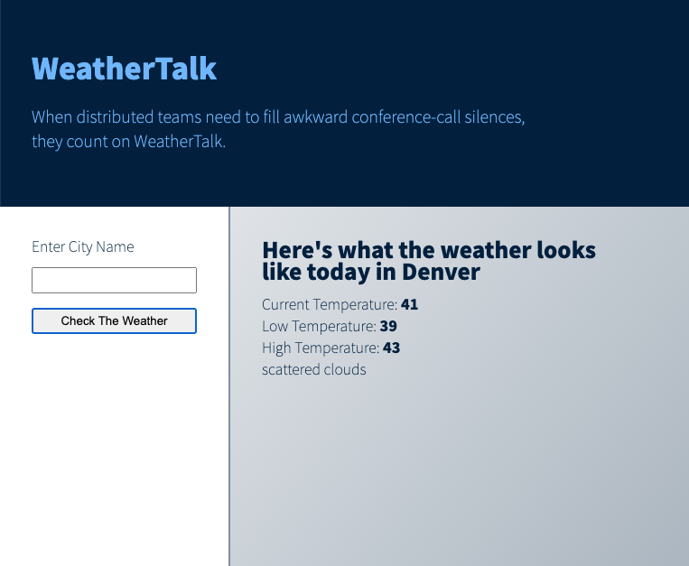

# Introduction to the OpenWeather Current Weather Data API

<!-- outline / structure notes -->

### Goals

By the end of this tutorial, you will be familiar with:

* How to get started using a public API
* Incorporating the Open Weather Map API in your own sample project
* The capabilities of the Open Weather API

### Overview

In this tutorial, we'll be using one of OpenWeather's free APIs. The OpenWeather API collection provides robust and easy-to-use weather data through a public API. With both free and subscription services, this tool provides developers access to a vast set data that is straightforward to incorporate into projects. From simple weather status results to complex data visualizations, OpenWeather has an API that can handle whatever creative endeavors you may have in mind.

Today, we'll build a locally-running small static site using vanilla JavaScript, HMTL, and CSS that displays city-specific weather data from the **OpenWeather Current Weather Data API**. By keeping the structure we're working within foundational, we can focus on the API as we become familiar with it rather than any framework-specific nuances. The concepts and approaches used in this basic application can be translated into the framework of your choice as you tackle larger, more complex projects leveraging OpenWeather APIs.

### Getting started

Getting up and running with the OpenWeather suite of APIs is user friendly. Navigate over to [OpenWeather Current and Forecast weather data collection](https://openweathermap.org/api), where you'll see all the API offerings available through OpenWeather. Each individual API has a brief overview on this page, as well as `API doc` and `Subscribe` buttons where you'll find documentation and be able to sign up to receive a unique API key for that particular data collection.

Click the `Subscribe` button under **Current Weather Data**, and you'll be directed to a pricing page. Here you'll find details on the available packages offered for this data collection. Click the `Get API Key` button under **Free** and you'll be prompted to create a new account. Once done, you can find your unique API key on your accounts page under the `API key` tab.

Once you have your key, you can try it out by entering the following API call in your browser.

```
api.openweathermap.org/data/2.5/weather?q={city name}&appid={API key}
```

If we break this down, we'll see two sets of curly braces: `{city name}` and `{API key}`. The content within these braces indicates the content you should update. Enter the name of a city you'd like to see weather data for as well our unique API key. An example of the completed url is:

```
api.openweathermap.org/data/2.5/weather?q=Denver&appid=f2e53f539786e6ab3e9318da74a9bc35
```

When we run this in the browser, we'll see the API response in the form of a JSON object. Take a moment and read through this to familiarize yourself with it -- these are all the values we can leverage as we begin to work with this API in our project.

```
{
  "coord": {
    "lon": -104.9847,
    "lat": 39.7392
  },
  "weather": [
    {
      "id": 801,
      "main": "Clouds",
      "description": "few clouds",
      "icon": "02d"
    }
  ],
  "base": "stations",
  "main": {
    "temp": 291.85,
    "feels_like": 286.83,
    "temp_min": 289.26,
    "temp_max": 293.15,
    "pressure": 1007,
    "humidity": 12
  },
  "visibility": 10000,
  "wind": {
    "speed": 2.68,
    "deg": 155,
    "gust": 7.6
  },
  "clouds": {
    "all": 23
  },
  "dt": 1616265830,
  "sys": {
    "type": 3,
    "id": 2004334,
    "country": "US",
    "sunrise": 1616245370,
    "sunset": 1616289103
  },
  "timezone": -21600,
  "id": 5419384,
  "name": "Denver",
  "cod": 200
}
```

This API response confirms that our API key is working, and now we can pull it into our application.

### The Project: Weather Talk

We'll be building a small application that helps start conversations with your colleagues on who live in different cities. When you don't know what to talk about, talk about the weather!

> Note: You can clone down this repo to run the example project locally on your machine. Because it is a simple static application, there are no required dependencies -- you should be able to clone and go!





<!-- #### Guided Practice (We do)
* Writer and reader both "doing" -->


<!-- #### Independent/Pair Practice (You do)
* Reader "doing", writer providing guidance
* Examples: questions in a Gist, implementing feature -->


<!-- ### Possible questions and/or misunderstandings
* What concepts might be misunderstand, and why? -->

It's worth noting that it is not best practice to share an API key publicly as we've done in this tutorial -- we can get away with it while working locally and experimenting with how to play with data, but if this were a live site doing so would present security risks. This type of private data is typically found in a project's server-side code, which our small site does not have. If you're interested in making a static site like this live on a hosting platform such as GitHub Pages, take a look at a tool like Firebase. If this is something you're interested in exploring, [this blog post](https://medium.com/pan-labs/dynamic-web-apps-on-github-pages-for-free-ffac2b776d45) can point you in the right direction.

<!-- #### The Closing
* Check for understanding
* Discuss any clarifications or student misconceptions
* Review goals, further resources, and next steps -->

### Outside Resources / Further Reading
* [FPO link to outside resource]()
